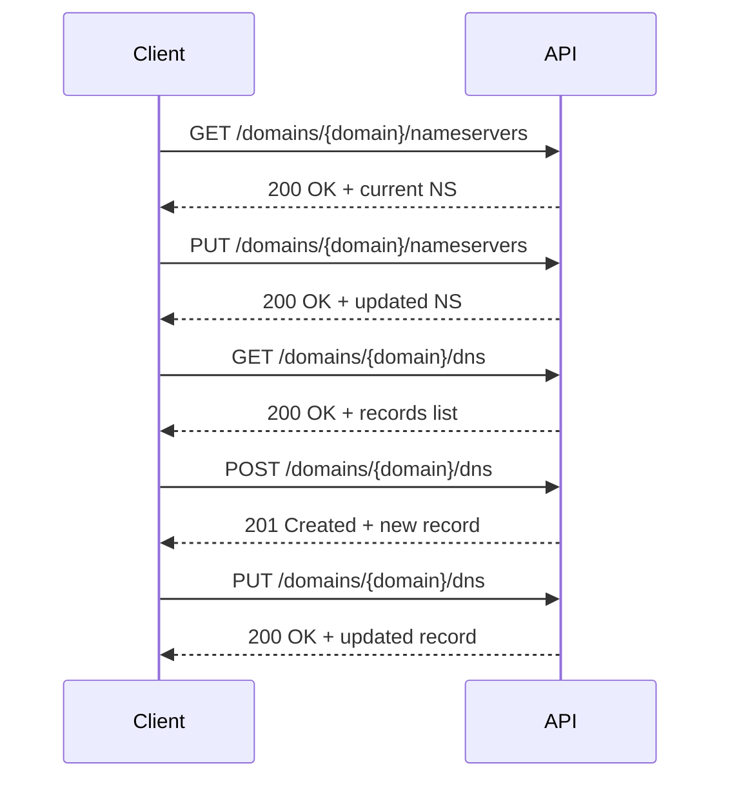

# Happy path: Domain management (nameservers & DNS)

Typical successful scenario for pointing a domain at hosting: set custom nameservers,
then inspect and manage the DNS zone. Only the successful path (2xx responses) is
shown.

### Sequence

#### Steps
***1. Environment setup***

export API_BASE="https://spacelama.com/modules/addons/public_api/api/index.php"
export API_KEY="your_api_key"

***2. Get current nameservers***
```bash
curl -X GET "$API_BASE?path=/domains/example.com/nameservers" \
  -H "Authorization: Bearer $API_KEY"
```
Response:
```json
{ 
    "success": true, 
    "data": ["ns1.yourservice.com", "ns2.yourservice.com"] 
}
```
***3. Set custom nameservers***
```bash
curl -X PUT "$API_BASE?path=/domains/example.com/nameservers" \
  -H "Authorization: Bearer $API_KEY" \
  -H "Content-Type: application/json" \
  -d '{ "nameservers": ["ns1.cloudflare.com", "ns2.cloudflare.com"] }'
```
Response:
```json
{ 
    "success": true, 
    "data": ["ns1.cloudflare.com", "ns2.cloudflare.com"] 
}
```
***4. List DNS records***
```bash
curl -X GET "$API_BASE?path=/domains/example.com/dns" \
  -H "Authorization: Bearer $API_KEY"
```
Response:
```json
{
  "success": true,
  "data": [
    { 
        "id": "rec_1", 
        "name": "@", 
        "type": "A", 
        "value": "192.0.2.1", 
        "priority": null, 
        "ttl": 3600 
    },
    { 
        "id": "rec_2", 
        "name": "www", 
        "type": "CNAME", 
        "value": "example.com.", 
        "priority": null, 
        "ttl": 14400 
    }
  ]
}
```
***5. Create a DNS record***
```bash
curl -X POST "$API_BASE?path=/domains/example.com/dns" \
  -H "Authorization: Bearer $API_KEY" \
  -H "Content-Type: application/json" \
  -d '{ "name": "www", "type": "A", "value": "203.0.113.10", "ttl": 3600 }'
```
Response (201 Created):
```json
{ 
    "success": true, 
    "data": { 
        "id": "rec_3", 
        "name": "www", 
        "type": "A", 
        "value": "203.0.113.10", 
        "priority": null, 
        "ttl": 3600 
    } 
}
```
***6. Update the DNS record***
```bash
curl -X PUT "$API_BASE?path=/domains/example.com/dns" \
  -H "Authorization: Bearer $API_KEY" \
  -H "Content-Type: application/json" \
  -d '{ "id": "rec_3", "name": "www", "type": "A", "value": "203.0.113.20", "ttl": 3600 }'
```
Response:
```json
{ 
    "success": true, 
    "data": { 
        "id": "rec_3", 
        "name": "www", 
        "type": "A", 
        "value": "203.0.113.20", 
        "priority": null, 
        "ttl": 3600 
    } 
}
```
Done — the domain's nameservers and DNS zone are configured. To remove a record, call DELETE /domains/{domain}/dns with id (or name+type); to reset nameservers to default, call 
DELETE /domains/{domain}/nameservers.
