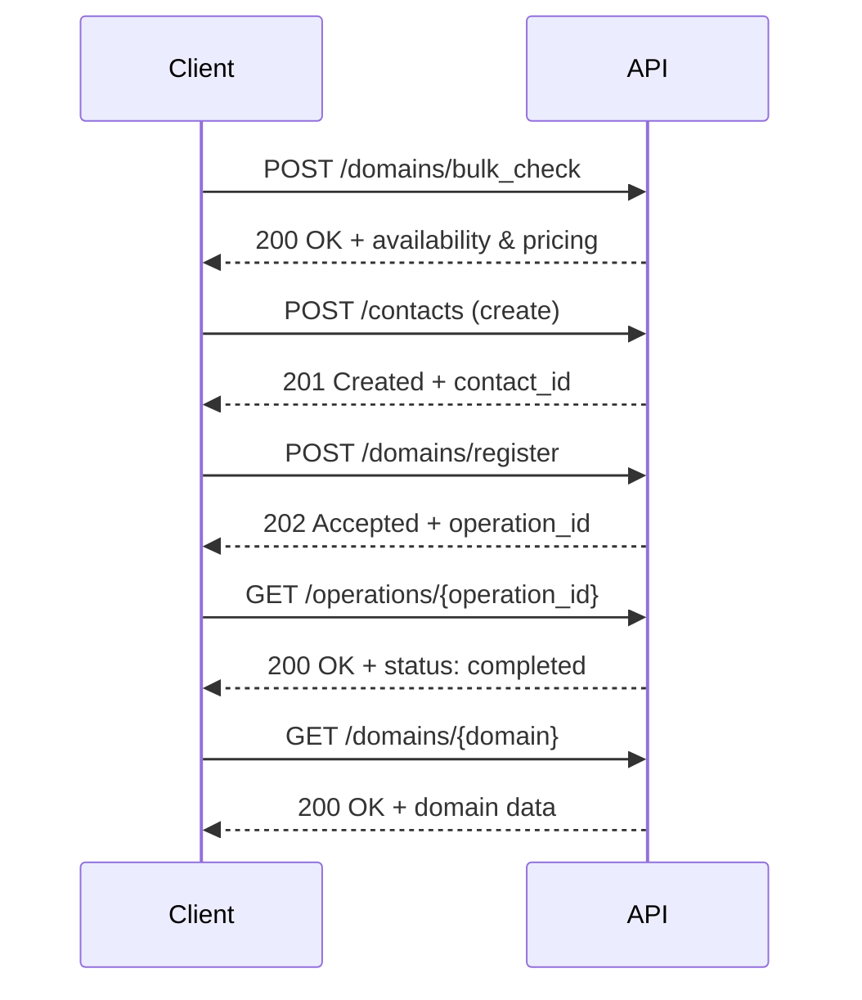

# Happy path: Domain registration

Typical successful end-to-end API flow: check domain availability → create contact → register domain → check operation status → fetch domain details. 
This shows only the successful path (2xx responses); see the API docs for error handling.

#### Sequence


#### Steps

***1. Environment setup***

export API_BASE="https://spacelama.com/modules/addons/public_api/api/index.php"
export API_KEY="your_api_key"

***2. Check domain availability***
```bash
curl -X POST "$API_BASE?path=/domains/bulk_check" \
  -H "Authorization: Bearer $API_KEY" \
  -H "Content-Type: application/json" \
  -d '{ "domains": ["example.com"] }'
```
Response:
```json 
{
  "success": true,
  "results": [
    {
      "domain": "example.com",
      "available": true,
      "premium": false,
      "tld": "com"
    }
  ]
}
```
***3. Create a contact***
```bash
curl -X POST "$API_BASE?path=/contacts" \
  -H "Authorization: Bearer $API_KEY" \
  -H "Content-Type: application/json" \
  -H "Idempotency-Key: $(uuidgen)" \
  -d '{
    "first_name": "Ada",
    "last_name": "Lovelace",
    "type_company": "individual",
    "email": "ada@example.com",
    "phone": "+1.4155551234",
    "address_line1": "123 Market St",
    "city": "San Francisco",
    "state": "CA",
    "postal_code": "94103",
    "country": "US"
  }'
```
Response:
```json
{ 
  "success": true, 
  "results": { 
    "contact_id": "ct_8a92f3c1", 
    "email": "ada@example.com" 
    } 
  }
```
***4. Register the domain (async)***
```bash
curl -X POST "$API_BASE?path=/domains/register" \
  -H "Authorization: Bearer $API_KEY" \
  -H "Content-Type: application/json" \
  -H "Idempotency-Key: $(uuidgen)" \
  -d '{
    "domains": [
      {
        "domain": "example.com",
        "period": 1,
        "allow_premium": false,
        "auto_renew": true,
        "contacts": {
          "registrant": { "contact_id": "ct_8a92f3c1" },
          "admin": { "use_registrant": true },
          "tech": { "use_registrant": true },
          "billing": { "use_registrant": true }
        }
      }
    ]
  }'
```
Response (202 Accepted):
```json
{
  "success": true,
  "results": [
    { 
      "operation_id": "op_01HQXZ7K3M9P5W2N", 
      "type": "domains.register", 
      "status": "pending"
    }  
  ]
}
```
***5. Check operation status***

This endpoint can be called whenever you want to check progress — there's no requirement to poll it in a tight loop. Most operations finish within 30–60 seconds.
```bash
curl -X GET "$API_BASE?path=/operations/op_01HQXZ7K3M9P5W2N" \
  -H "Authorization: Bearer $API_KEY"
```  
Once finished:
```json
{ 
  "success": true, 
  "operation_id": "op_01HQXZ7K3M9P5W2N", 
  "status": "completed" 
}
```
***6. Retrieve domain details***
```bash
curl -X GET "$API_BASE?path=/domains/example.com" \
  -H "Authorization: Bearer $API_KEY"
```
Response:
```json
{ 
  "success": true, 
  "data": { 
    "domain": "example.com", 
    "status": "Active", 
    "auto_renew": true 
  } 
}
```
Done — the base happy path is complete.
