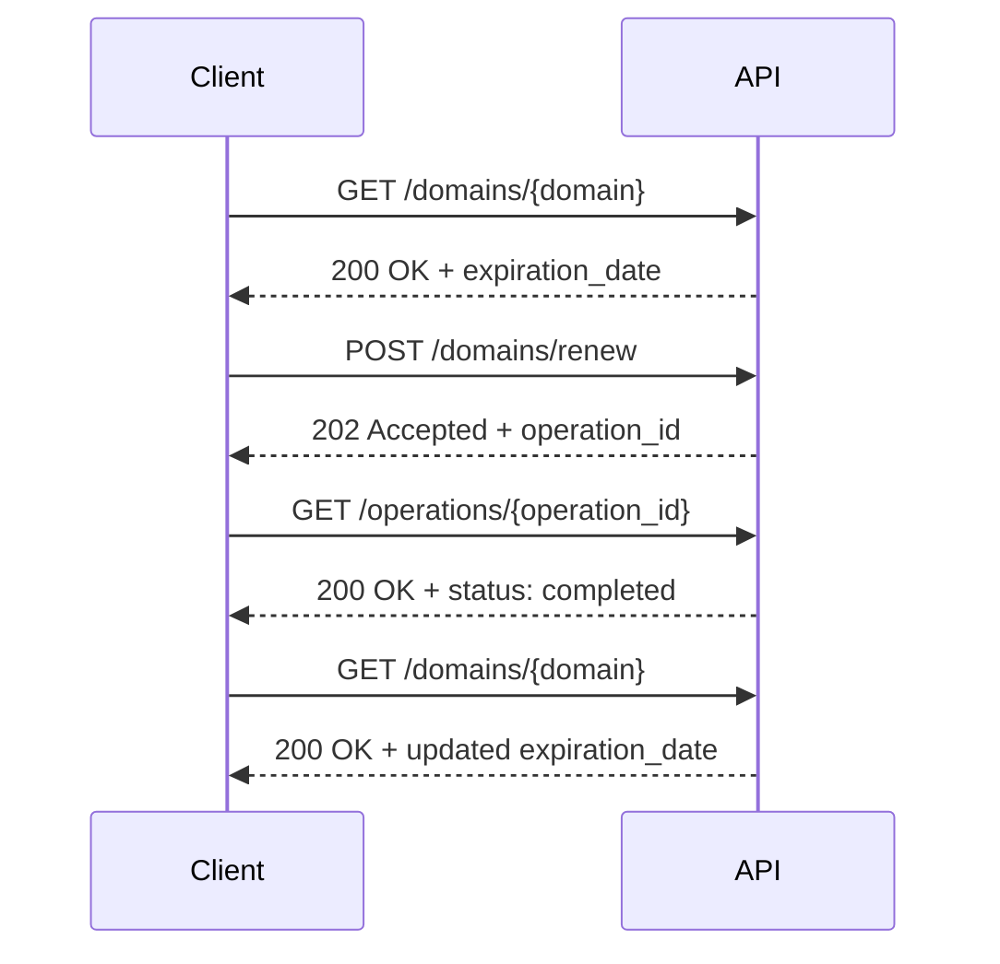

# Happy path: Domain renewal

Typical successful scenario for extending a domain's registration period before it expires: check current expiration → submit renewal → operation status → check the new expiration date. 
Only the successful path (2xx responses) is shown.

#### Sequence

#### Steps
***1. Environment setup***
```bash
export API_BASE="https://spacelama.com/modules/addons/public_api/api/index.php"
export API_KEY="your_api_key"
```

***2. Check current domain status***
```bash
curl -X GET "$API_BASE?path=/domains/example.com" \
  -H "Authorization: Bearer $API_KEY"
```
Response:
```json
{ 
    "success": true, 
    "data": { 
        "domain": "example.com", 
        "status": "Active", 
        "expiration_date": "2026-08-15T00:00:00Z" 
    } 
}
```
***3. Submit renewal (async)***
```bash
curl -X POST "$API_BASE?path=/domains/renew" \
  -H "Authorization: Bearer $API_KEY" \
  -H "Content-Type: application/json" \
  -H "Idempotency-Key: $(uuidgen)" \
  -d '{
    "domains": [
      { "domain": "example.com", "period": 1 }
    ]
  }'
```  
If `addons` is omitted, current addon settings on the domain are renewed as-is.
Up to 100 domains can be submitted per request (excess domains are ignored).

Response (202 Accepted):
```json
{
  "success": true,
  "results": [
    { 
        "operation_id": "op_01HR3F8N2K7T1Q9M", 
        "type": "domains.renew", 
        "status": "pending" 
    }
  ]
}
```
***4. Check operation status***

This endpoint can be called whenever you want to check progress — there's no requirement to poll it in a tight loop. Most operations finish within 30–60 seconds.
```bash
curl -X GET "$API_BASE?path=/operations/op_01HR3F8N2K7T1Q9M" \
  -H "Authorization: Bearer $API_KEY"
```  
Once finished:
```json
{
  "success": true,
  "data": {
    "operation_id": "op_01HR3F8N2K7T1Q9M",
    "type": "domains.renew",
    "status": "completed",
    "progress": { "total": 1, "succeeded": 1, "failed": 0, "in_progress": 0, "pending": 0 },
    "items": [
      { "domain": "example.com", "status": "succeeded", "new_expiration_date": "2027-08-15T00:00:00Z", "error_code": null }
    ]
  }
}
```
***5. Check the new expiration date***
```bash
curl -X GET "$API_BASE?path=/domains/example.com" \
  -H "Authorization: Bearer $API_KEY"
```
Response:
```json
{ 
    "success": true, 
    "data": { 
        "domain": "example.com", 
        "status": "Active", 
        "expiration_date": "2027-08-15T00:00:00Z" 
    } 
}
```
Done — the domain's expiration date is extended by the renewal period.
