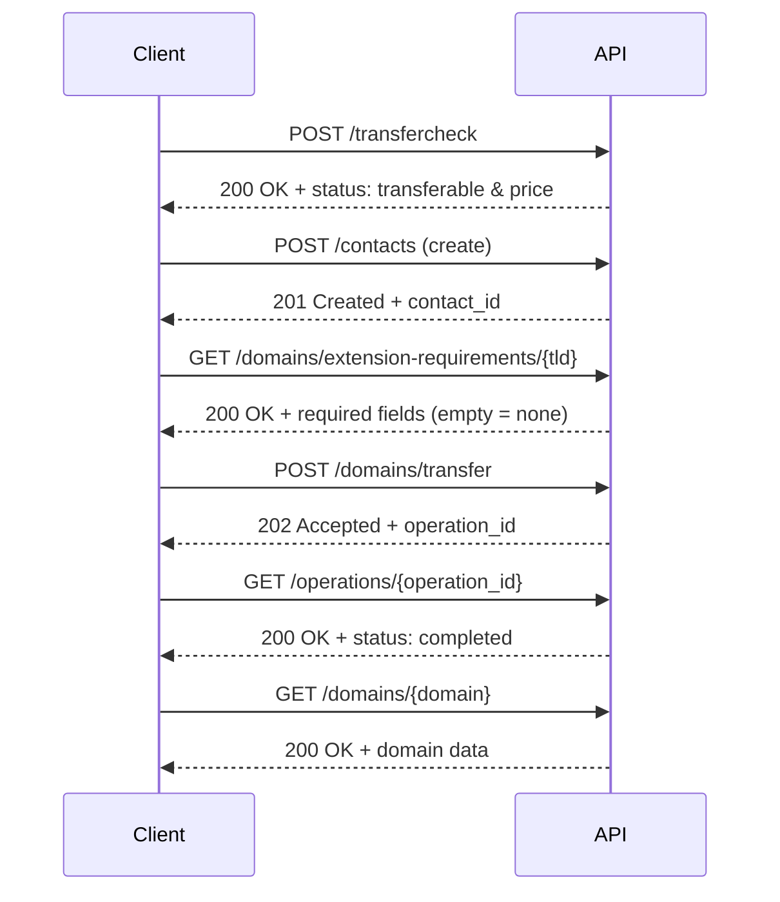

# Happy path: Domain transfer

Typical successful scenario for transferring an existing domain to your account: check transferability → prepare a contact → check TLD extra fields → submit transfer → check operation status → fetch domain details.
Only the successful path (2xx responses) is shown.

Before you start (outside the API): at the current registrar, unlock the domain, disable WHOIS privacy if needed, and obtain the **auth code** (EPP code). The domain must usually be older than 60 days.

#### Sequence


#### Steps

***1. Environment setup***
```bash
export API_BASE="https://spacelama.com/modules/addons/public_api/api/index.php"
export API_KEY="your_api_key"
```

***2. Check transferability***

Up to 32 domains per request. `auth_code` is optional but gives the most accurate result. Prices are returned in EUR.
```bash
curl -X POST "$API_BASE?path=/transfercheck" \
  -H "Authorization: Bearer $API_KEY" \
  -H "Content-Type: application/json" \
  -d '{ "domains": [{ "domain": "example.com", "auth_code": "AUTH-CODE-123" }] }'
```
Response:
```json
{
  "success": true,
  "summary": {
    "total": 1,
    "transferable": 1,
    "not_transferable": 0,
    "invalid": 0,
    "managed": 0,
    "unregistered": 0
  },
  "currency": "EUR",
  "domains": [
    {
      "domain": "example.com",
      "status": "transferable",
      "message": "transferable",
      "is_premium": false,
      "price": 12.99
    }
  ]
}
```
Proceed only for domains with `status: transferable`.

***3. Create a contact***

A transfer requires a registrant. Reuse an existing `contact_id` (see `GET /contacts`) or create a new one.
```bash
curl -X POST "$API_BASE?path=/contacts" \
  -H "Authorization: Bearer $API_KEY" \
  -H "Content-Type: application/json" \
  -H "Idempotency-Key: $(uuidgen)" \
  -d '{
    "first_name": "Ada",
    "last_name": "Lovelace",
    "type_company": "individual",
    "email": "ada@example.com",
    "phone": "+1.4155551234",
    "address_line1": "123 Market St",
    "city": "San Francisco",
    "state": "CA",
    "postal_code": "94103",
    "country": "US"
  }'
```
Response (201 Created):
```json
{
  "success": true,
  "results": {
    "contact_id": "ct_8a92f3c1",
    "email": "ada@example.com"
  }
}
```

***4. Check TLD extra fields (only some TLDs)***

TLD without a leading dot (e.g. `com`, `us`, `co.uk`).
```bash
curl -X GET "$API_BASE?path=/domains/extension-requirements/com" \
  -H "Authorization: Bearer $API_KEY"
```
Response:
```json
{ "success": true, "data": [] }
```
An empty `data` array means no extra fields are required. Otherwise pass them in the transfer request as `tld_extensions`, keyed by TLD (e.g. `{ "us": { ... } }`).

***5. Submit the transfer (async)***

Note: the auth-code field here is `auth` (not `auth_code` as in `/transfercheck`).
```bash
curl -X POST "$API_BASE?path=/domains/transfer" \
  -H "Authorization: Bearer $API_KEY" \
  -H "Content-Type: application/json" \
  -H "Idempotency-Key: $(uuidgen)" \
  -d '{
    "domains": [
      {
        "domain": "example.com",
        "auth": "abc-123-epp-code",
        "allow_premium": false,
        "auto_renew": false,
        "contacts": {
          "registrant": { "contact_id": "ct_8a92f3c1" },
          "admin": { "use_registrant": true },
          "tech": { "use_registrant": true },
          "billing": { "use_registrant": true }
        }
      }
    ]
  }'
```
Omit `nameservers` to keep the domain's current NS.

Response (202 Accepted):
```json
{
  "success": true,
  "results": [
    {
      "operation_id": "op_01HQXZ7K3M9P5W2N",
      "type": "domains.transfer",
      "status": "pending",
      "created_at": "2026-04-22T10:14:32Z",
      "items": [
        { "domain": "example.com", "status": "pending" }
      ]
    }
  ]
}
```

***6. Check operation status***

This endpoint can be called whenever you want to check progress — there's no requirement to poll it in a tight loop.
```bash
curl -X GET "$API_BASE?path=/operations/op_01HQXZ7K3M9P5W2N" \
  -H "Authorization: Bearer $API_KEY"
```
Once finished:
```json
{
  "success": true,
  "data": {
    "operation_id": "op_01HQXZ7K3M9P5W2N",
    "type": "domains.transfer",
    "status": "completed",
    "progress": { "total": 1, "succeeded": 1, "failed": 0, "in_progress": 0, "pending": 0 },
    "items": [
      { "domain": "example.com", "status": "succeeded", "error_code": null }
    ]
  }
}
```

***7. Retrieve domain details***
```bash
curl -X GET "$API_BASE?path=/domains/example.com" \
  -H "Authorization: Bearer $API_KEY"
```
Response:
```json
{
  "success": true,
  "data": {
    "domain": "example.com",
    "status": "Active",
    "auto_renew": false
  }
}
```
Done — the domain is transferred and appears on your account.
